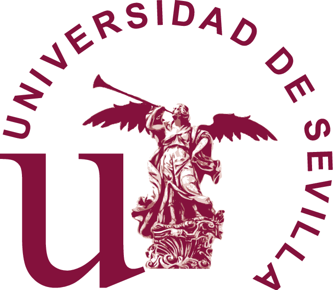
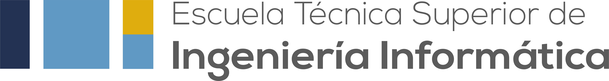

        Nos gustaría dar las gracias a los siguientes socios y patrocinadores para el curso 24/25.
    

---

# Universidad de Sevilla

<table width="100%" border="1">
    <tr>
      <td width="70%" style="vertical-align: top;">
        La Universidad de Sevilla es una institución pública con sede en Sevilla, España. Ocupa el tercer lugar en el país en términos de número de estudiantes y es la principal universidad en Andalucía. Fundada hace más de 500 años, es una de las universidades más antiguas de España. Además de su destacada oferta académica, la universidad posee un valioso patrimonio histórico y artístico, que incluye siete edificios declarados Bien de Interés Cultural, una extensa colección de obras de arte y un importante archivo histórico. Su influencia se extiende más allá de la educación, contribuyendo significativamente a la investigación, la cultura y el desarrollo social en la región.
      </td>
      <td width="30%" style="vertical-align: top;">
        
      </td>
    </tr>
  </table>

# Escuela Técnica Superior de Ingeniería Informática

<table width="100%" border="1">
    <tr>
      <td width="70%" style="vertical-align: top;">
        La Escuela Técnica Superior de Ingeniería Informática (ETSII) de la Universidad de Sevilla, establecida en 2001, ocupa el antiguo edificio de la Escuela Técnica Superior de Ingenieros Industriales, recientemente renovado. Con una superficie de 24.000 m², la ETSII ofrece modernas instalaciones que incluyen aulas, laboratorios, una biblioteca y un centro de cálculo propio. Actualmente la ETSII es la sede principal para la realización de concursos, charlas, sesiones de trabajo y otros eventos académicos y profesionales de nuestro club.
      </td>
      <td width="30%" style="vertical-align: top;">
        
      </td>
    </tr>
  </table>

