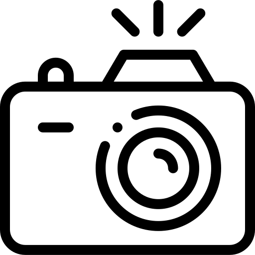

El pasado viernes 23 de febrero se celebró la primera edición de CompliCAUS, una competición de algoritmia organizada por el Club de Algoritmia de la Universidad de Sevilla. Este evento, patrocinado por la Escuela Técnica Superior de Ingeniería Informática (ETSII), congregó a estudiantes de diferentes facultades y niveles académicos, así como a alumnos de bachillerato, en un reto que puso a prueba sus habilidades en la resolución de problemas algorítmicos.

La competición se llevó a cabo utilizando la plataforma HackerRank, que permitió a los participantes enviar y evaluar automáticamente sus soluciones. El evento fue diseñado para que cualquier persona, independientemente de su nivel de experiencia, pudiera participar y disfrutar del desafío. Por ello, se incluyeron problemas de diversa dificultad, lo que hizo que la estrategia de los competidores para identificar y resolver los problemas más accesibles fuera clave para obtener un buen resultado.

Entre los participantes, hubo representación de estudiantes de distintos cursos de la Escuela Técnica Superior de Ingeniería Informática, de la Escuela Técnica Superior de Ingeniería, de la Facultad de Matemáticas, e incluso de estudiantes de bachillerato del Colegio Santa Ana de Sevilla. Esto demuestra que la pasión por la programación competitiva no tiene fronteras y que cualquiera, sin importar su nivel o experiencia, puede aprender y disfrutar en este tipo de eventos.

La competición se mantuvo reñida desde el comienzo, con una primera hora durante la que los primeros puestos cambiaban constantemente. Sin embargo, al finalizar el evento, los tres primeros lugares quedaron definidos:

<!-- - **Primer puesto:** Pablo Moreno Moreu
- **Segundo puesto:** Jaime Argilés Pérez
- **Tercer puesto:** Nicolás Sibello Litrán -->

# Premios Principales

| Pos. | Participante           | Puntos  | Ver Imagen                                                                 |
|------|------------------------|---------|----------------------------------------------------------------------------|
| 1    | Pablo Moreno Moreu      | 569.13  |  |
| 2    | Jaime Argilés Pérez     | 526.67  |  |
| 3    | Nicolás Sibello Litrán  | 522.23  |  |

    

        &times;
        
    

Los organizadores del Club de Algoritmia también aprovecharon para agradecer a todos los que hicieron posible este evento, especialmente a la Escuela Técnica Superior de Ingeniería Informática por el patrocinio y a Mª Lourdes Miró, Subdirectora de Estudiantes, Innovación y Responsabilidad Social, por su apoyo incondicional.

Este ha sido solo el comienzo de lo que esperamos sea una larga tradición en la Universidad de Sevilla. Estamos seguros de que vendrán más competiciones como esta, donde los estudiantes podrán seguir desafiándose, aprendiendo y, por supuesto, divirtiéndose con la programación y la algoritmia. ¡Nos vemos en la próxima edición de CompliCAUS!

